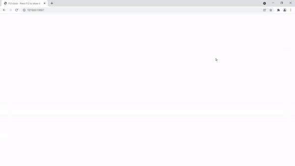

# f12-Clock

A Zen-styled programmer's clock in the HTML comments.

Humor matters.



## Demo site

[Demo site](http://hrkt.github.io/f12-clock/)

## features

- f12-clock run in "F12" developers console via HTML comment
- No dependency to other modules

## Usage

### HTML

1. import f12-clock.js (*1)
2. add id to the tag use choose

```
<!DOCTYPE html>
<html id="f12-clock">
  <head><title>f12-clock - Press F12 to show it</title></head>
  <body>
    <script src="./dist/f12-clock.js"></script>
  </body>
</html>

```

(*1)...


#### method 1: use CDN

```
<script src="https://cdn.jsdelivr.net/npm/f12-clock@0.1.0/dist/f12-clock.js"></script>
```

#### method 2: copy a file from GitHub and place it into your project

f12-clock has no dependency, so simply download and use it.

```
dist/f12-clock.js
```
or

```
dist/f12-clock-min.js
```

#### method 3: use npm https://www.npmjs.com/package/f12-clock

```
npm i f12-clock --save-dev 
```

## Tested on

|OS|Browser|Status|
|--|--|--|
|Windows|Firefox 94|✅|
|Windows|Chrome 96.0|✅|
|macOS|Safari 15.0|✅|


## Future work

- support for options
- support for emoji

## LICENSE

MIT

## CI


